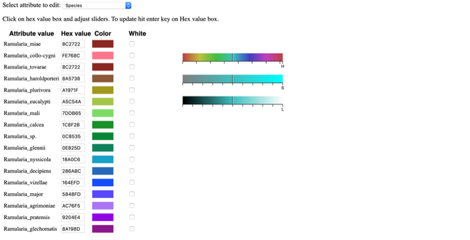

[PDF manual](data/tbas-documentation/TBAS_User_Manual_v2.2.pdf)

### Table of Contents
1. [Color Editor](#1-color-editor)
2. [Data Standardization](#2-data-standardization)
3. [De novo single or multi-locus phylogenetic analysis](#3-de-novo-single-or-multi)
4. [References](#4-references)
5. [Appendix](#5-appendix)

### 1. Color editor

The purpose of the color editor is to allow the user to select preferred colors for the layout of the tree. When T-BAS creates a tree it randomly assigns colors to attributes from all colors in the spectrum. For each attribute, the rows in the legend are arranged by color so that the user can find the label of a color by looking in the legend. The colors can be changed in the color editor. However, the order of entries in the legend remains as for the original colors assigned. There is no limit to how many values or attributes can be edited.

To change the colors, click the color editor button and the color editor window will pop up.

There are two ways to change the colors. Colors can be selected on the color bars or inputting a known hex color value.

To change the color using the HSL (hue, saturation, lightness) color bars, slide the center vertical black line (while holding down the left mouse button) on one of the 3 bars to the left or right. One or all three bars can be modified in order to display the desired color. The letter under the corresponding bar indicate the following: H (hue), S (saturation), L (lightness).

Selecting a specific attribute in the pull-down menu will display the current color arrangement on the tree. Here the hex values can be changed, if known. Hex values can be searched online or can be viewed [here](data/tbas-documentation/Color_Codes_1.pdf). Enter the value into the box and press Enter/Return.

If the value is not known, click inside a box of an attribute to be changed, and select a new color on the color bar or adjust the vertical black lines until a desired color appears. For the change to take effect, the cursor must be inside the box that has the edited color value and press Enter/Return. The colors will then be updated in the color editor, in the tree, and in the legend. To select the color white, click the box in the last column.

Clicking the color reset button will undo all changes.

To copy a color scheme from one tree to another, copy hex values and then enter them manually in the color editor on the next tree.

### 2. Data Standardization

PhyloXML is an XML language for describing evolutionary trees or networks and data associated with them (Han & Zmasek 2009). In T-BAS, DNA sequences and associated specimen metadata are phylogenetically placed on curated multi-locus reference trees and the placement results are standardized using an extended PhyloXML format. This standardization allows placements and associated specimen attributes (e.g. host, locality, environmental traits) to be readily viewed, archived and importantly analyzed within a phylogenetic context. Unlike other data standards used for phylogenetic trees, PhyloXML can be adapted and extended to integrate disparate forms of data. To this end we added additional PhyloXML elements to accommodate raw sequence data and alignments that are associated with each taxonomic scale in the tree – from phylum to individuals in populations. This standardization provides a consistent handling of the data and is currently used by T-BAS and other tools in the DeCIFR toolkit. 

Our new PhyloXML schema named “cifr PhyloXML” includes new tags: cifr:otus, cifr:attributes, and cifr:genes.

**cifr:otus**
A cifr:otu tag saves all the information in the OTUs of the submitted samples.

A cifr:otu tag contains a cifr:name, cifr:leaf_name, and a cifr:taxon tag.

The cifr_taxon tag contains cifr:taxon_level and cifr:taxon_val tags with placement information for this OTU.

Also in the cifr:otu are cifr:placement tags with attributes and unaligned sequences for each sample in the OTU.

**cifr:attributes**

A cifr:attributes tag contains information for specimen metadata in the tree structure.

The cifr:attributes tag contains cifr:attribute, which contains cifr:name and cifr:value.

**cifr:genes**

The cifr:gene tags saves metadata of the alignments.

The cifr:genes tag contains cifr:gene, which contains cifr:locus, cifr:nchar, and cifr:exset.

### 3. De novo single or multi-locus phylogenetic analysis

This feature under the RAxML options can be used to Infer best tree for reference and unknown query sequences. Potential applications include: (1) inferring trees for species delimitation using the Genealogical Concordance Phylogenetic Species Recognition (GCPSR) concept (Taylor et al 2000), and (2) inferring an input tree for Poisson Tree Processes (PTP) model to delimit putative species (Zhang et al 2013).

### 4. References

Section 1 Color Editor  
+ https://www.compuhelpts.com/Color_Codes_1.pdf

Section 2 Data Standardization  
      Han MV, Zmasek CM (2009) phyloXML: XML for evolutionary biology and comparative genomics. BMC bioinformatics 10, 356.

Section 3 De novo single or multi-locus phylogenetic analysis  
      Taylor, J.W., D.J. Jacobson, S. Kroken, T. Kasuga, D.M. Geiser, D.S. Hibbett, et al. 2000. Phylogenetic species recognition and         species concepts in fungi. Fungal Genet Biol 31: 21-32. doi:10.1006/fgbi.2000.1228.  
      Zhang, J., P. Kapli, P. Pavlidis and A. Stamatakis. 2013. A general species delimitation method with applications to phylogenetic       placements. Bioinformatics 29: 2869-2876. doi:10.1093/bioinformatics/btt499.

### 5. Appendix
