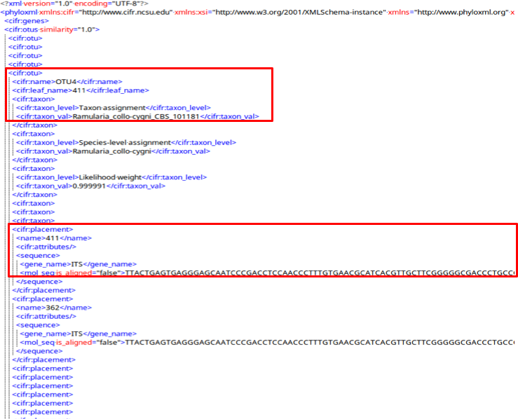

[PDF manual](data/tbas-documentation/TBAS_User_Manual_v2.2-01-03-20.pdf)

### Table of Contents
1. [Color Editor](#1-color-editor)
2. [Data Standardization](#2-data-standardization)
3. [DeCIFR REST Server] (#3-decifr-rest-server)
4. [De novo single or multi-locus phylogenetic analysis](#4-de-novo-single-or-multi-locus-phylogenetic-analysis)
5. [References](#5-references)
6. [Appendix](#6-appendix)
    - Description of Terms

### 1. Color editor

The purpose of the color editor is to allow the user to select preferred colors for the layout of the tree. When T-BAS creates a tree it randomly assigns colors to attributes from all colors in the spectrum. For each attribute, the rows in the legend are arranged by color so that the user can find the label of a color by looking in the legend. The colors can be changed in the color editor. However, the order of entries in the legend remains as for the original colors assigned. There is no limit to how many values or attributes can be edited.

To change the colors, click the color editor button and the color editor window will pop up.

There are two ways to change the colors. Colors can be selected on the color bars or inputting aknown hex color value.

To change the color using the HSL (hue, saturation, lightness) color bars, slide the center vertical black line (while holding down the left mouse button) on one of the 3 bars to the left or right. One or all three bars can be modified in order to display the desired color. The letter under the corresponding bar indicate the following: H (hue), S (saturation), L (lightness).

Selecting a specific attribute in the pull-down menu will display the current color arrangement on the tree. Here the hex values can be changed, if known. Hex values can be searched online or can be viewed here. Enter the value into the box and press Enter/Return.

If the value is not known, click inside a box of an attribute to be changed, and select a new color on the color bar or adjust the vertical black lines until a desired color appears. For the change to take effect, the cursor must be inside the box that has the edited color value and press Enter/Return. The colors will then be updated in the color editor, in the tree, and in the legend. To select the color white, click the box in the last column.

Clicking the color reset button will undo all changes.

To copy a color scheme from one tree to another, copy hex values and then enter them manually in the color editor on the next tree.

### 2. Data Standardization

In T-BAS, DNA sequences and associated specimen metadata are phylogenetically placed on curated multilocus reference trees and the placement results are saved as Metadata Enhanced PhyloXML (MEP) files. The MEP format allows placements and associated specimen attributes (e.g. host, locality, environmental traits) to be readily viewed, archived and importantly analyzed within a phylogenetic context. MEP files are structured to adhere to the minimum information about any (x) sequence (MIxS) family of standards defined by the [Genomic Standards Consortium](https://press3.mcs.anl.gov/gensc/). A [template](https://decifr.hpc.ncsu.edu/schemas/specimen_metadata_MIxS_definitions.csv) is provided for users to fill in and submit when performing a phylogeny-based placement in T-BAS. Additional categories of metadata information can be added. MIxS headers and metadata are saved in MEP files as defined in the XML schemas below. The use of MEP files ensures interoperability and retrieval of relevant sequences and metadata for downstream applications. This standardization provides a consistent handling of the data and is currently used by T-BAS and other tools in the DeCIFR toolkit. MEP is based on XML (Han & Zmasek 2009), a widely used markup language for representing and sharing information, and PhyloXML, an extension of XML with custom tags for describing evolutionary trees or networks.

The standard pre-defined [XML schema for phyloXML](http://www.phyloxml.org/1.20/phyloxml.xsd) is used as a starting point for validating MEP files. PhyloXML includes a phylogeny element that saves the tree information and associated alignments. MEP extends this by adding (1) an OTUs tag that saves the taxonomic assignments, associated query metadata and sequences for each OTU, (2) a tag to each clade that is a leaf in the tree and saving the metadata for that leaf, and (3) a gene tag that saves the locus name, the number of sequence characters, and the positions of the excluded unaligned character set (i.e. exset) for each alignment

MEP uses two associated schema definitions:

- [cifr_phyloxml.xsd](https://decifr.hpc.ncsu.edu/schemas/cifr_phyloxml.xsd) to show how custom tags are added to PhyloXML.
- [cifr.xsd](https://decifr.hpc.ncsu.edu/schemas/cifr.xsd) to define custom tags in the http://www.cifr.ncsu.edu namespace.

The MEP schema includes new tags: cifr:otus, cifr:attributes, and cifr:genes.

**cifr:otus**
A cifr:otu tag saves all the information in the OTUs of the submitted samples.

A cifr:otu tag contains a cifr:name, cifr:leaf_name, and a cifr:taxon tag.

The cifr_taxon tag contains cifr:taxon_level and cifr:taxon_val tags with placement information for this OTU.

Also in the cifr:otu are cifr:placement tags with attributes and unaligned sequences for each sample in the OTU.

**cifr:attributes**

A cifr:attributes tag contains information for specimen metadata in the tree structure.

The cifr:attributes tag contains cifr:attribute, which contains cifr:name and cifr:value.

**cifr:genes**

The cifr:gene tags saves metadata of the alignments.

The cifr:genes tag contains cifr:gene, which contains cifr:locus, cifr:nchar, and cifr:exset.

### 3. DeCIFR REST Server

Administrative Users:
The code for a REST server that can be used to share results stored in a cifr PhyloXML over the internet is available at https://github.com/ncsu-decifr/decifr-rest.

The server uses the Python framework Flask – https://palletsprojects.com/p/flask/. Installation instructions are included. 

All users:

Opening the URL to /list returns a list of run IDs of all the XMLs in the folder.

Clicking on a Run ID link (ie; 3F7THARX) will allow the leaves, queries, and OTUs to be viewed without opening the tree.

Click on ‘leaves’ to see the sample names that are present in a tree.

Click on the metadata link for Ramulaira_calcea_CBS_101612 (#2).

The metadata for that sample will be shown.

Clicking on “queries” will display the query and the tree placement information:

Clicking on OTU will display the following information:

### 4. De novo single or multi-locus phylogenetic analysis

This feature under the RAxML options can be used to Infer best tree for reference and unknown query sequences. Potential applications include: (1) inferring trees for species delimitation using the Genealogical Concordance Phylogenetic Species Recognition (GCPSR) concept (Taylor et al 2000), and (2) inferring an input tree for Poisson Tree Processes (PTP) model to delimit putative species (Zhang et al 2013).

### 5. References

**Section 1 Color Editor**

[https://www.compuhelpts.com/Color_Codes_1.pdf](https://www.compuhelpts.com/Color_Codes_1.pdf)

**Section 2 Data Standardization**

Han MV, Zmasek CM (2009) phyloXML: XML for evolutionary biology and comparative genomics. BMC bioinformatics 10, 356.

**Section 4 De novo single or multi-locus phylogenetic analysis** 

Taylor, J.W., D.J. Jacobson, S. Kroken, T. Kasuga, D.M. Geiser, D.S. Hibbett, et al. 2000. Phylogenetic species recognition and species concepts in fungi. Fungal Genet Biol 31: 21-32. doi:10.1006/fgbi.2000.1228.  

Zhang, J., P. Kapli, P. Pavlidis and A. Stamatakis. 2013. A general species delimitation method with applications to phylogenetic placements. Bioinformatics 29: 2869-2876. doi:10.1093/bioinformatics/btt499.

### 6. Appendix
